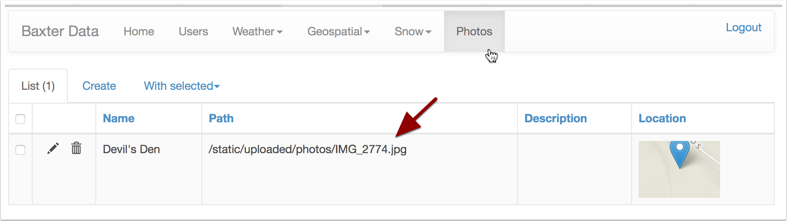
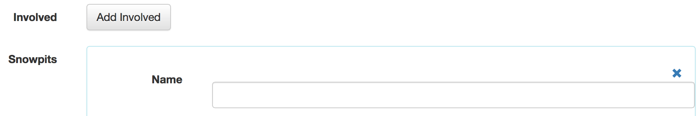
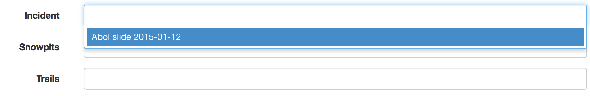
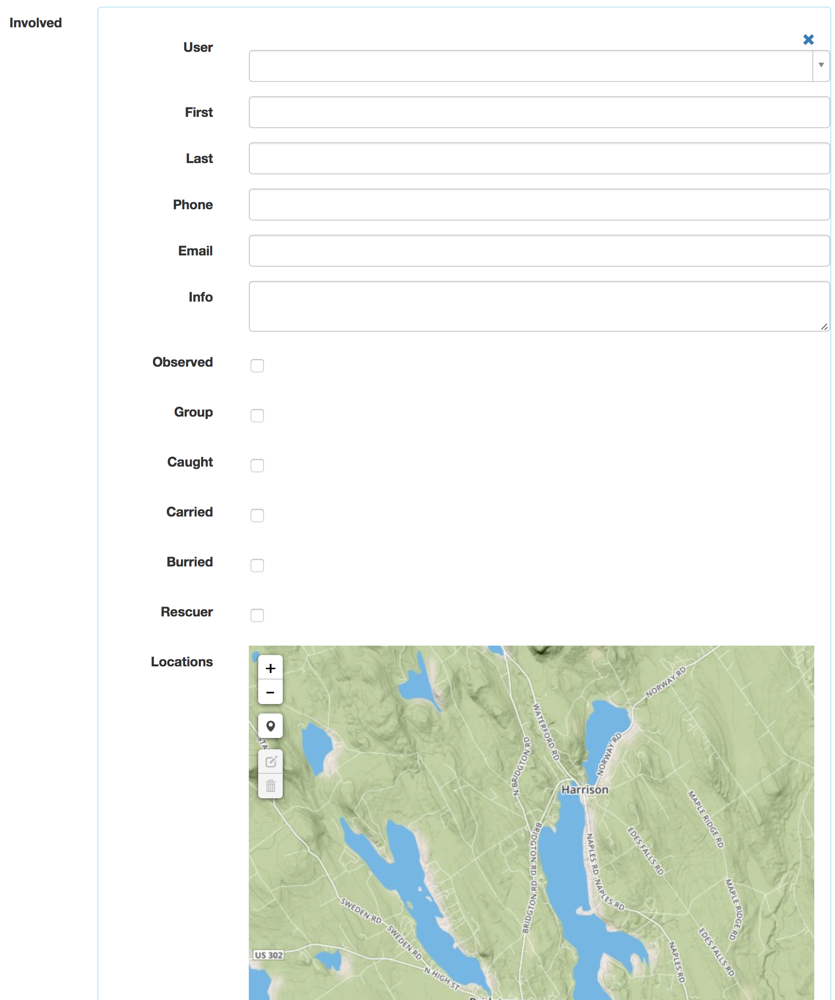

Baxter User Help
================

.. toctree::

Contents:

* `Editing`_
* `User Accounts`_
* `Database Access`_
* `Markdown`_
* `Data Types`_
    * `Avalanche Incidents`_
    * `Avalanche Paths`_
    * `Trails`_
    * `Snowpits`_
    * `Photos`_
    * `Users`_


Editing
-------
Thanks for helping us build out or selection of data.

There may be a lot of fields, but we are trying to have it each has a specific
use. If you have some data that you believe we should be tracking, but there is
currently not a field for please get in touch and we can discuss it. Also you
could `submit an issue <https://github.com/abkfenris/baxter-flask/issues>`_.

Much of the admin interface is set up to be easy to use, and we are working on
adding more help information for less obvious fields.

For geospatial data there are maps where you can create lines, points, and
polygons depending on what that specific field needs. We are looking at direct
geospatial data upload in the future, but right now database access is also
avaliable.


User Accounts
-------------
Right now it is not possible to change your password via the website. The
horrific one given to you is what you get. Password changes and the ability to
modify your own account is coming.


Database Access
---------------
If you have geospatial data in ArcGIS or QGIS and you wish to connect to the
database and edit directly, please be in touch, and we will set you up with an
account. Database accounts are seperate than accounts for the admin. The site is
running a `PostGIS <http://postgis.net>`_ database on port 5432.

Setup:

* `ArcGIS 10.1 <http://resources.arcgis.com/en/help/main/10.1/index.html#/Setting_up_a_connection_to_PostgreSQL/002p0000003q000000/>`_
* `ArcGIS 10.2 <http://resources.arcgis.com/en/help/main/10.2/index.html#/Setting_up_a_connection_to_PostgreSQL/002p0000003q000000/>`_
* `QGIS <http://www.gistutor.com/quantum-gis/20-intermediate-quantum-gis-tutorials/34-working-with-your-postgis-layers-using-quantum-gis-qgis.html>`_


Markdown
--------
In places which will generate longer text blurbs, like the description of an
Avalanche Incident, can be formatted as `Markdown <https://help.github.com/articles/markdown-basics/>`_.

Markdown is a more human readable, and natural way of formatting text compared
to writing html.

* `Paragraphs`_
* `Headings`_
* `Lists`_
* `Links`_
* `Images`_


Paragraphs
^^^^^^^^^^
Paragraphs are followed by blank lines. Consecutive lines without a blank line
become the same paragraph.


Headings
^^^^^^^^
Headings are designated by some number of ``#`` symbols before a line of text.
The more ``#`` symbols the less important the heading is. ::

    # Large Heading
    ## Secondary Heading
    ##### Much smaller heading

Which will become

.. code-block:: html

    <h1>Large Heading</h1>
    <h2>Secondary Heading</h2>
    <h5>Much smaller heading</h5>


Links
^^^^^
Links are very easily formatted in Markdown. Just insert ``[link text](link url)``
into the description. Example: ::

    [National Avalanche Center](http://www.fsavalanche.org)

Will be formatted into:

.. code-block:: html

    <a href="http://www.fsavalanche.org">National Avalanche Center</a>

And displayed as `National Avalanche Center <http://www.fsavalanche.org>`_


Lists
^^^^^
For a basic unordered (bulleted) list, make sure you lead with a blank line,
then use either a ``*`` or a ``-`` per item. ::

    * Item
    * Item
    * Item

Generates an HTML list:

.. code-block:: html

    <ul>
        <li>Item</li>
        <li>Item</li>
        <li>Item</li>
    </ul>

Which will form:

* Item
* Item
* Item


Images
^^^^^^
Images uploaded via the admin will be in ``/static/uploaded/photos/``. To get
the path of an image, check Admin/Photos list for the path.



If you are in the in the process of uploading images within an Avalanche
Incident or other location, then you'll need to finish up and save before the
image is uploaded to the server, and the path becomes visible.

To insert an image into the markdown type ````.

For example: ::

    

Gets turned into this code which will nicely render an image:

.. code-block:: html

    

Currently images are only setup to be displayed at full size, but they will
scale down to fit the containing object they are in.


Data Types
----------
There are several other different types of data accessible, but not everything
currently effects editing or what the public can see.

Currently hidden data types include:

* Weather Observations
* Weather Forecasts
* Points of Interest
* Avalanche Problems
* Snowpits

Several of the data types will allow you to add related data. There will be an
add button, and you can add several. Click the X to remove the connection.



On  related data, where it may be related to several different things, you may
have to edit the individual photo or snowpit and select the data in the drop
down menu as it cannot be selected in the inline editor.




Avalanche Incidents
-------------------
Fields:

* Observer
* Path
* Name
* Display
* Observation Date
* Occurence Date
* Location
* Elevation
* Aspect
* Trigger
* Trigger Additional Information
* Avalanche Problem
* Weak Layer
* Size -  Relative to Path
* Size - Destructive Force
* Depth
* Width
* Vertical
* Slope Angle
* Number of People Involved
    * Caught
    * Carried
    * Injuried
    * Partly Buried
    * Fully Buried
    * Killed
    * Rescuers
* Group Activity
* Group Travel
* Snow Profile
* Image
* Description
* Summary
* Geospatial
    * Crown
    * Bed Surface
    * Debris Field
* `Involved`_
* `Snowpits`_
* `Photos`_
* Problems

Involved
^^^^^^^^
If information is avaliable for each person involved in a slide, their contact
info can be recorded, how they were involved, and what location/s they were at.




Avalanche Paths
---------------

Fields:

* Name
* Description
* Path
* Aspect
* Display
* Incidents


Trails
------

Fields:

* Geom
* Use Type
* Tid
* Skitrail
* Name
* Length Mi
* Status
* Display
* Pub Share
* Gpsupdate
* Gpsunit
* Gpsuser
* Bspaid
* Tsid
* Display Wu
* Display Wn
* Ttype
* Season
* Shape Leng
* Tclass
* Maintclass
* Slength
* Min Slope
* Max Slope
* Avg Slope
* Length Ft
* Description
* `Photos`_


Snowpits
--------

Fields:

* Incident
* Name
* File
* Location
* Elevation
* Aspect
* Description
* `Photos`_


Photos
------

Fields:

* Incident
* `Snowpits`_
* `Trails`_
* Name
* Location
* Description
* Photo


Users
-----
Users are not really a data type in and of themselves, they are for site
management purposes. Most people will not even see this selection.

Observers
^^^^^^^^^
Not all users are designated observers by the park. Those who are can be selected
in Avalanche Incidents and several other places as being the source of data.

Roles
^^^^^
There are different levels of roles avaliable on the site. Currently there is
not many differences between them, other than being able to manage other users,
but contributors cannot delete information.

* Admin
    In addition from being able to add, edit, and delete data from the site,
    Admins can also manage Users.
* User
    Can add, edit, and delete information on the site
* Contributor
    Can add and edit information in the site
