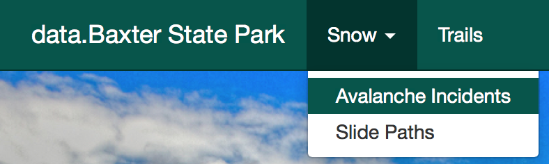
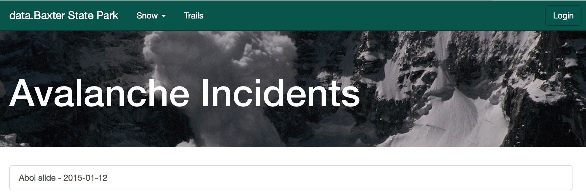
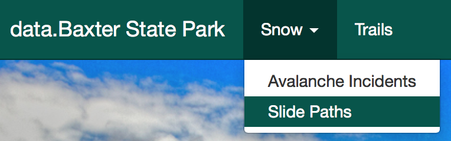
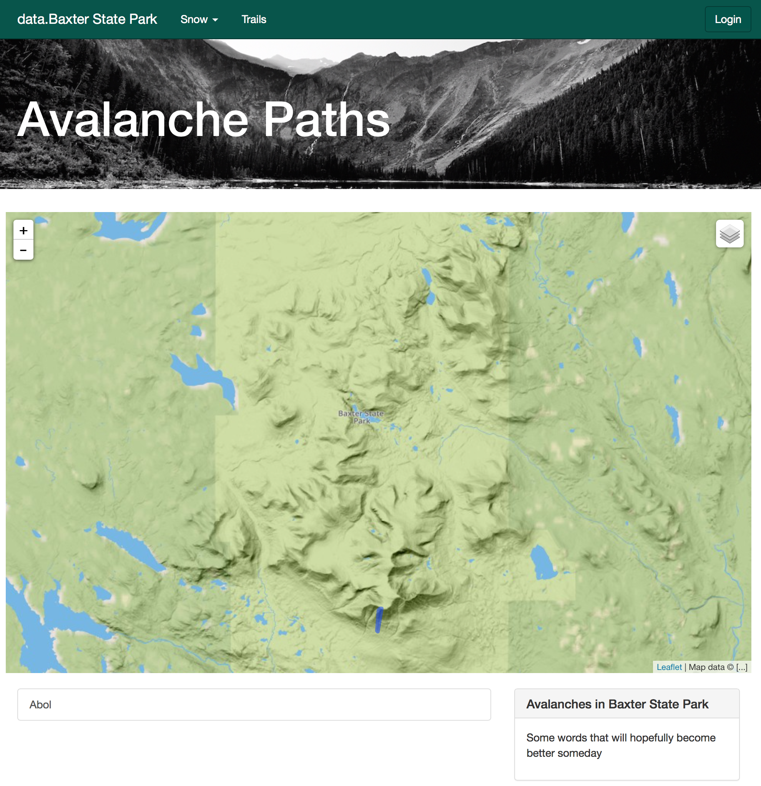
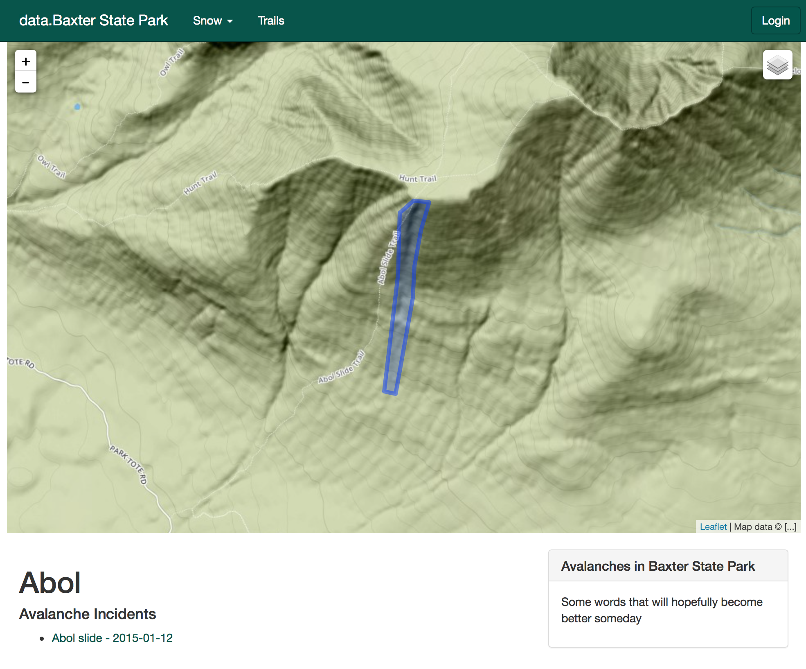
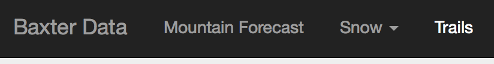
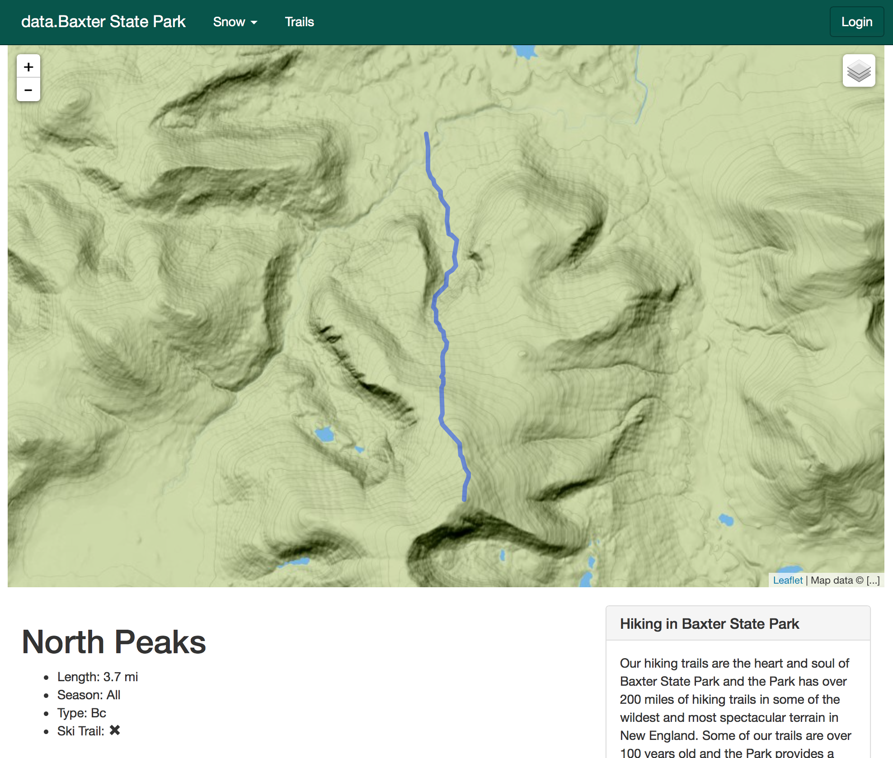

Public Help
===========

.. toctree::

Welcome to Baxter State Park's pile of data!

We are working on providing public access to historical data
from the park through this site.

Getting Started
---------------

If you are just wishing to view information, you can dive right into the site.
This page has some basic help to navigate some of the features of the site.

If you have information to submit, you will need an account. Please contact the
Park to arrange for access.

Avalanche Incidents
-------------------
To view avalanche incidents select Snow > Avalanche Incidents
from the top menu

This will bring you to a list of incidents, ordered by date
(newest to oldest).

From there click on an incident to view
details about that incident.

.. image:: _static/public-incident-view.png
   :scale: 50 %

An incident page will show a map if detailed geographical data is available for
an avalanche, like the Crown, Bed Surface, and Debris Fields.

1. Tabs between Description and Details
2. The Details tab starts out with general data about the avalanche incident with more detail available below.
3. Number of people involved in the incident
4. Details about how the avalanche occurred.
5. General site information.

Hit Description for the observers writeup about an incident.

Avalanche Paths
---------------
To view avalanche paths select Snow > Slide Paths from the top menu

Select a path from the list or off the map.

Each path will have a map of extents, incidents, and maybe a description.

Trails
------
To view trails select Trails from the top menu

Then select a trail from the map, or from the list to view.

.. image:: _static/public-trails-list.png
   :scale: 50%

Each trail will have some information about it, and it's route.

